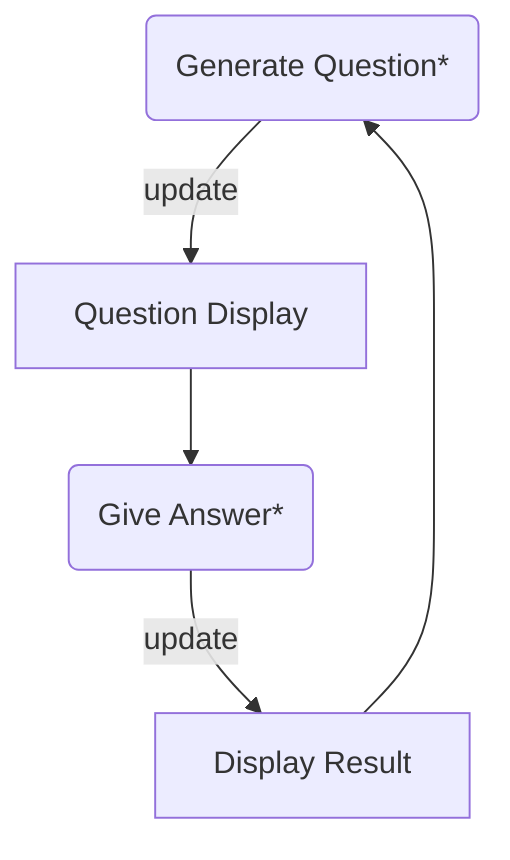

```mermaid
graph TD
1(Generate Question*)--update-->
2[Question Display]-->
3(Give Answer*)--update-->
4[Display Result]-->1
```

First step was to identify the flow, which made it much more manageable

