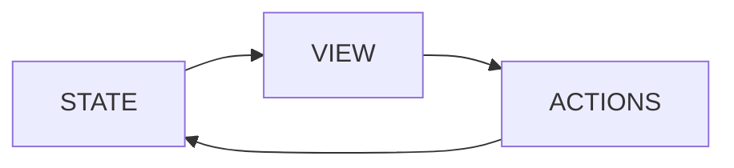

Is the basic flow

Redux has more fine grained control

- Initial setup
	- create store using a root reducer function
	- store calls root reducer once, saves value as initial state
	- when UI rendered, UI components access state, and subscribe to any future store updates.

- Updates
	- event
	- the app code dispatches an event to the store
	- store runs reducer function again and saves new state
	- store notifies all parts of UI that are subscribed
	- each UI component checks to see if it needs updating, if so, rerendering.