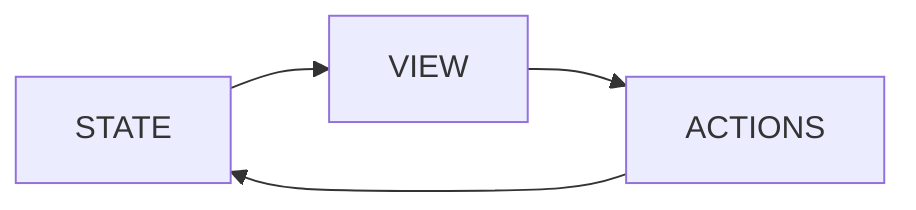
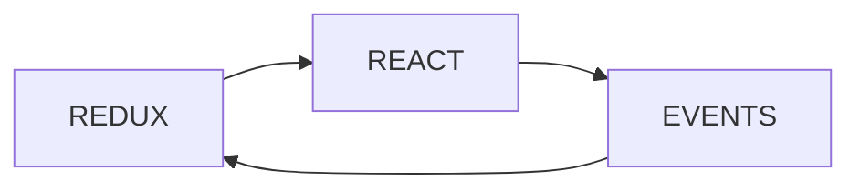

https://redux.js.org/tutorials/essentials/part-1-overview-concepts

```jsx
function Counter() {
	// State: a counter value
	const [counter, setCounter] = useState(0)
	// Action: code that causes an update to the state when something happens
	const increment = () => {
		setCounter(prevCounter => prevCounter + 1)
	}

// View: the UI definition
	return (
		<div\>
		Value: {counter} <button onClick={increment}>Increment</button>
		</div\>
	)
}
```

This app has these parts:

- The **State** - the "source of truth" as it is called somewhat pretentiously
- The **View** - the declarative description of the UI which refers to the state
- The **Actions** - the event handling which updates in the state and view

This can be modeled by a one way flow



This is similar to the [[model view controller]]

Yet if there are multiple components that need the same state, especially when there might be components that depend on that state in a whole different part of the application. Often this involves ["lifting state up"](https://reactjs.org/docs/lifting-state-up.html) to the most common parent ancestor. But what if that is the root, and what if the root is 20 levels away from the component?

You can approach this by removing state from the tree and storing it separately. So that any part of the tree can call the state store and modify it. So the state becomes the state, the tree the view, and any node in the tree can trigger an action in the state.



This is the way that [[Redux]] solves the problem.